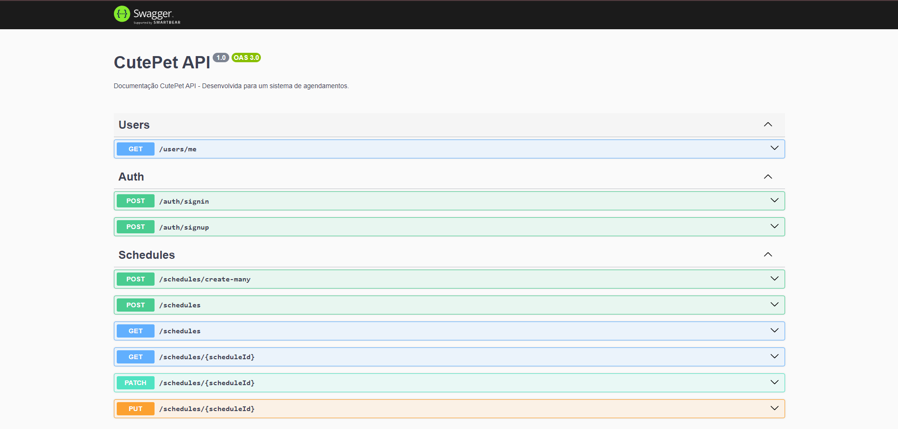
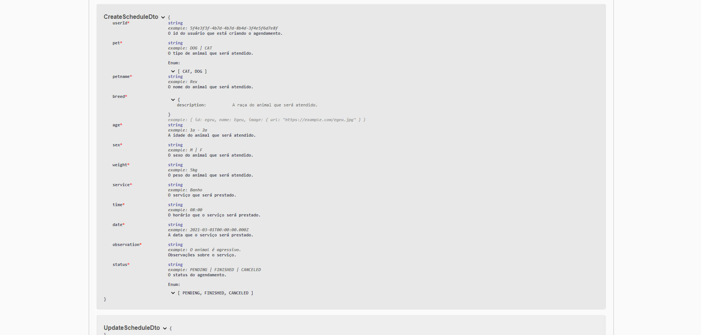

<div align='center'>
<a href="http://nestjs.com/" target="blank"></a>
<h1>CutePet - API</h1> 
</div>

### Descrição
Bem-vindo à API desenvolvida para o meu projeto ``CutePet``, um sistema inovador de agendamentos para PetShops, proporcionando facilidade e eficiência na gestão de compromissos para banhos, tosas e consultas.

Principais recursos:
- Estrutura Robusta: A API é cuidadosamente estruturada, seguindo as melhores práticas do Nest.js para garantir uma base sólida e escalável.

- Operações CRUD Completas: Com as operações (Create, Read, Update, PATCH) estão implementadas de forma abrangente nas rotas da API, proporcionando funcionalidades completas para gerenciamento de dados.

- Autenticação Segura com JWT: A autenticação é tratada de maneira segura e eficiente, utilizando JSON Web Tokens (JWT) para garantir a segurança das transações e acessos à API.


### Documentação
Documentação Clara com Swagger: A API vem com uma documentação abrangente, gerada automaticamente pelo Swagger. Isso facilita a compreensão e o uso da API, permitindo uma integração suave para desenvolvedores.

Sinta-se à vontade para explorar a documentação e aproveitar os recursos oferecidos por esta API para impulsionar seus projetos financeiros. Estamos comprometidos em fornecer uma experiência sólida e eficaz para atender às suas necessidades de desenvolvimento.

## 🛠️ Tecnologias

📁 **Back-end**
- [Nest.js](https://github.com/nestjs/nest) 
- [Prisma](https://www.prisma.io)
- [MongoDB](https://www.mongodb.com)
- [Mongoose](https://mongoosejs.com/docs/guide.html)

🔋 **Versionamento e Deploy**
- [Git](https://git-scm.com)
- [Vercel](https://vercel.com/)

<br>

## Installation

```bash
$ npm install
```

## Running the app

```bash
# development
$ npm run start

# watch mode
$ npm run start:dev

# production mode
$ npm run start:prod
```

## Clone

```bash
  # clone project
  $ git clone https://github.com/renovatt/cutepet-back-end.git
```

## Doc Swagger

```bash
    # swagger documentation
    http://localhost:5000/docs
```





<br>

🚀 **Como contribuir?**

- Siga-me no GitHub para oferecer suporte.
- Dê uma estrela ao projeto.
- Conecte-se comigo no LinkedIn para expandir nossa rede e curta o projeto.

<br>

🧑‍💻 **Criado por**
[@renovatt](https://www.linkedin.com/in/renovatt/)